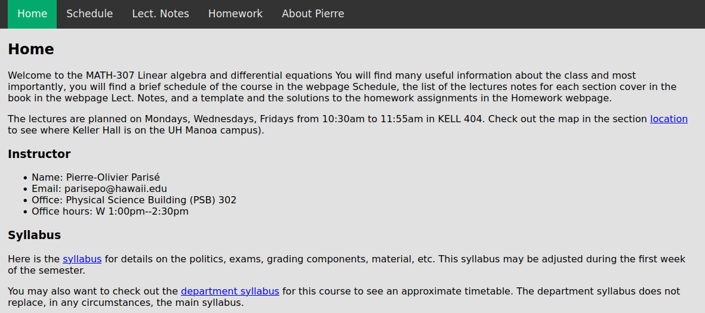
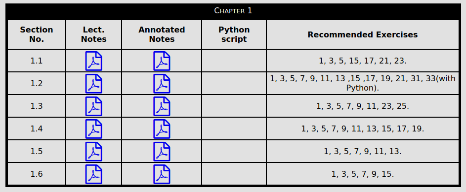
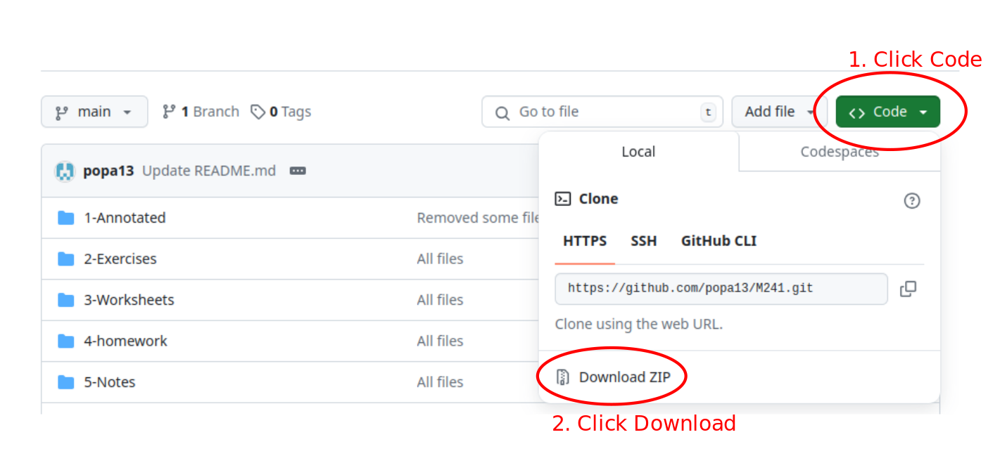

# A note to the viewer
You will find all the resources that I created while teaching Linear Algebra and Differential Equations (M307) at the University of Hawai'i at Manoa. You can see below a screenshot of the home page of the website I created for the class. The website can be accessed through this link: [https://mathopo.ca/courses-website/math-307/math-307](https://mathopo.ca/courses-website/math-307/math-307).

In the following note, I describe in more details each section of the website.

## Home Page 
The Home page is the main page where all of the information for the class is available. The important documents such as the syllabus, the study guide, and some resources are available. Also, the day and time when we meet and the location is also shown using a google map. 

## Schedule
The Schedule page was created to track the assignments, midterms, and lecture meetings. I used a google calendar and share it with the student so they can link it to their phone.

## Lecture Notes
The Lecture Notes page was the most important one. This is where the students could download the lectures notes to annotate them in class. After the lecture, I uploaded the annotated lecture notes completed during lecture that day. You can either find the lecture notes in the files in this github repository or go download them from the course website directly. Whatever option you prefer :) 

To organize the content of this webpage, I used tables as pictured below.

Each table has the Chapter number as a title and contains all the material for that chapter. 
- The first column is the section number of the chapter.
- The second column is the pdf for the lecture notes (no annotations).
- The third column is the pdf for the updated annotated lecture notes.
- The fourth column is the python script associated to that section.
- The fifth column is suggested exercises to complete in the textbook (the answers-key were at the end of the textbook).

The only exception to that format was the table for Chapter 2. There is no column for python scripts. You can create your own!

## Homework
The Homework webpage explains the format of the homework. I decided to assign exercises from the textbook weekly. You can find the solutions to each homework (13 in total) in the file Homework in this repository.  

I won't explain more, just go read the text on that webpage. It will be self-explainatory.  

## How I taught the class
For this class, I lectured using the lecture notes templates. I used my tablet wacom connected to my laptop. I would project my notes at the same time as lecturing. It was the responsibility of the students to arrive prepared to the class, with the notes already downloaded or printed.

There was a homework assignment every week, except when there was an exam the next week. The Schedule webpage gives you more information on that.

I had two midterms and one final. The final exam was not cummulative. 

I used Python regularly outside and during lectures. You can see in the table in the lecture notes webpage that there is a Python script for almost every section. For the homework, if the students wanted to, they could use Python to answer the questions on the homework. They had to submit their Python script in their homework submission. 

I hope this will help you plan you class. 

# Final remarks
All the pictures used in the lecture notes are from the main textbook used at UH Manoa *Calculus* by James Stuart. 

If you want to download all the files from this repository as a .zip on your computer, follow the steps illustrated in the picutre below.

Here is a list of useful tools/material that used constantly in my classes:

- Xournal++: [https://xournalpp.github.io/](https://xournalpp.github.io/).
- Wacom tablet (medium): [https://www.wacom.com/en-ca/products/pen-tablets/wacom-intuos](https://www.wacom.com/en-ca/products/pen-tablets/wacom-intuos).
- Desmos to plot graphs of functions: [https://www.desmos.com/](https://www.desmos.com/)
- Desmos' YouTube Channel (to learn how to use the tools from Desmos): [https://www.youtube.com/@Desmos](https://www.youtube.com/@Desmos).

# Contact Info
You can reach me by email parisepierreolivier@gmail.com if you have any questions or if you would like to add your own contributions.
Best of luck!

